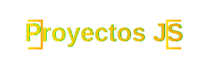

<div align="center">

</div>

<div align="center">


</div>

## 📖 Descripción

ProyectosJS es una colección de proyectos web interactivos desarrollados con JavaScript vanilla y frameworks modernos. La plataforma sirve como portafolio y recurso de aprendizaje, presentando ejemplos prácticos y aplicaciones funcionales.

## 🌟 Características Principales

- ⚡ **Alto Rendimiento**: Construido con Astro para una carga optimizada
- 📱 **Diseño Responsivo**: Experiencia fluida en todos los dispositivos
- 🎨 **UI Moderna**: Interfaz limpia y atractiva con Tailwind CSS
- 🔍 **SEO Optimizado**: Estructura y metadata mejorada para buscadores

## 🛠️ Tecnologías

- **Frontend**: 
  - Astro (Framework principal)
  - React (Componentes interactivos)
  - Tailwind CSS (Estilos)
  - JavaScript Vanilla

- **Desarrollo**:
  - Vite
  - TypeScript
  - Node.js

## 📦 Instalación

1. **Clonar el repositorio**
```bash
git clone https://github.com/mikeldev0/proyectosjs.git
```

2. **Instalar dependencias**
```bash
# Navegar al directorio
cd proyectosjs

# Instalar con npm
npm install
```

3. **Iniciar entorno de desarrollo**
```bash
npm run dev
```

## 🚀 Despliegue

```bash
# Construir para producción
npm run build

# Previsualizar la build
npm run preview
```

## 📂 Estructura del Proyecto

```
/
├── src/
│   ├── components/
│   ├── layouts/
│   ├── pages/
│   └── styles/
├── public/
└── package.json
```

## 🤝 Contribuir

1. Fork del repositorio
2. Crear una rama para tu feature (`git checkout -b feature/AmazingFeature`)
3. Commit de tus cambios (`git commit -m 'Add: AmazingFeature'`)
4. Push a la rama (`git push origin feature/AmazingFeature`)
5. Abrir un Pull Request

## 📄 Licencia

Este proyecto está bajo la Licencia MIT. Ver el archivo [LICENSE](LICENSE) para más detalles.

## 📞 Contacto

Mikel Echeverria - [@MikelEcheve](https://x.com/MikelEcheve) - mikel@mikeldev.com

🔗 [mikeldev.com](https://www.mikeldev.com)

---

<div align="center">

⭐ Si te ha gustado el proyecto, ¡no olvides darle una estrella! ⭐

</div>
